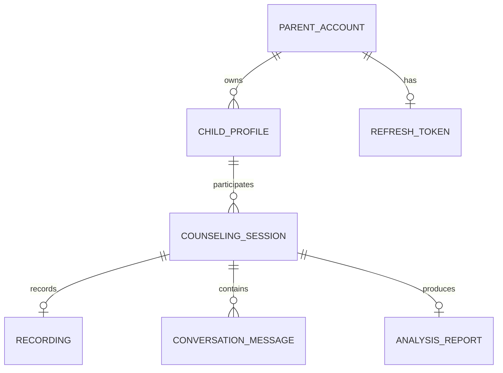

# Backend ERD

## 핵심 규칙

- 부모 계정 하나는 여러 아이 프로필을 가질 수 있다.
- 부모 계정 하나에는 활성 리프레시 토큰을 최대 하나만 저장한다.
- 상담 세션은 부모가 작성한 갈등 상황과 한 명의 아이를 기준으로 생성한다.
- 녹음과 분석 결과는 상담 세션당 최대 하나, 대화 메시지는 여러 개 저장한다.
- 대화 메시지 순서는 `(counseling_session_id, sequence_no)`로 보장한다.
- 액세스 토큰은 저장하지 않고 리프레시 토큰은 SHA-256 해시만 저장한다.
